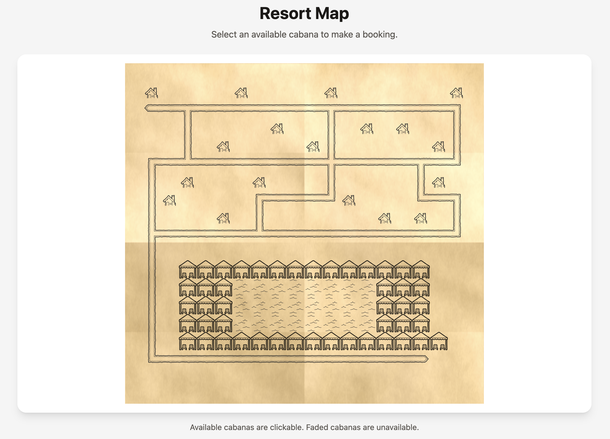

# Resort Map

An interactive resort map that allows current hotel guests to view poolside cabana availability and book an available cabana using their room number and guest name.



## Features

- Visual resort map rendered from an ASCII map file
- Tile-based display of cabanas, chalets, paths, pool, and empty areas
- Current cabana availability loaded through a REST API
- One-step cabana booking form
- Guest validation using room number and guest name
- Immediate visual update after a successful booking
- Clear validation and API error messages
- In-memory cabana booking state
- Configurable map and guest files through CLI arguments
- Automated backend and frontend tests

## Technology

### Backend

- Node.js
- Express
- Vitest
- Supertest

### Frontend

- React
- Vite
- Tailwind CSS
- Vitest
- React Testing Library

## Requirements

A recent Node.js LTS version and npm are required.

## Installation

Clone the repository and install the backend and frontend dependencies from the project root:

```bash
git clone https://github.com/tvsxar/resort-map.git
cd resort-map

npm install --prefix backend
npm install --prefix frontend
```

## Running the application

Start both the backend and frontend with one command from the project root:

```bash
npm start
```

The application uses the included example files by default:

```text
backend/map.ascii
backend/bookings.json
```

The backend runs on:

```text
http://localhost:1999
```

The frontend URL is printed by Vite in the terminal, normally:

```text
http://localhost:5173
```

Stop both applications with `Ctrl+C`.

## Using custom input files

The start command accepts custom map and bookings files:

```bash
npm start -- --map ./path/to/map.ascii --bookings ./path/to/bookings.json
```

Paths are resolved relative to the project root.

Both options are optional. When an option is omitted, the included example file is used.

Example:

```bash
npm start -- --map ./backend/map.ascii --bookings ./backend/bookings.json
```

## Using the application

1. Open the frontend URL shown in the terminal.
2. Select a cabana that is not faded.
3. Enter the room number and guest name.
4. Submit the form.
5. If the details match a current guest, the booking succeeds and the cabana immediately becomes unavailable.

Cabana bookings are stored in memory. Restarting the backend clears all cabana bookings.

## Map format

The map is a plain-text ASCII file where each character represents one tile:

| Symbol | Meaning     |
| ------ | ----------- |
| `W`    | Cabana      |
| `p`    | Pool        |
| `#`    | Path        |
| `c`    | Chalet      |
| `.`    | Empty space |

Each line represents one row of the resort map.

## Bookings format

Guest data is provided as JSON. A booking is accepted only when the submitted room number and guest name match an entry in the supplied bookings file.

The application does not use passwords or user accounts, as requested in the task requirements.

## API

### Health check

```http
GET /api/health
```

### Resort map and cabana availability

```http
GET /api/map
```

Example response:

```json
{
  "map": ["...", ".W.", "..."],
  "bookedCabanas": []
}
```

### Book a cabana

```http
POST /api/cabanas/:cabanaId/book
Content-Type: application/json
```

Example request body:

```json
{
  "room": "101",
  "guestName": "John Smith"
}
```

A cabana ID uses the map coordinates in `row-column` format, for example `11-3`.

## Tests

Run all backend and frontend tests from the project root:

```bash
npm test
```

Run the test suites separately:

```bash
npm --prefix backend test
npm --prefix frontend test
```

The automated tests cover:

- REST API responses
- Guest validation
- Cabana coordinate validation
- Duplicate booking prevention
- Cabana availability updates
- Map rendering
- Booking form interaction
- Client-side validation
- Server error feedback
- Successful frontend booking flow

## Additional checks

Run the frontend linter:

```bash
npm run lint
```

Create a production frontend build:

```bash
npm run build
```

## Design decisions and trade-offs

The application is intentionally small and uses a straightforward React and Express architecture. The backend owns the map data, guest validation, and cabana availability, while the frontend relies entirely on the REST API and only manages interface state.

Cabana bookings are stored in memory because persistent storage was not required. This keeps the implementation simple, but all cabana bookings are cleared when the backend restarts. Authentication, a database, and additional state-management libraries were intentionally omitted to avoid unnecessary complexity.

The map is rendered as a CSS grid, using the position of each character as the tile coordinate. Cabana IDs use the same `row-column` coordinates, which keeps the frontend and backend representation consistent without introducing a separate identifier system.

The root runner starts both applications and forwards the `--map` and `--bookings` arguments to the backend, providing the required single entrypoint.

## AI-assisted workflow

The AI-assisted development workflow is documented in [AI.md](./AI.md).
